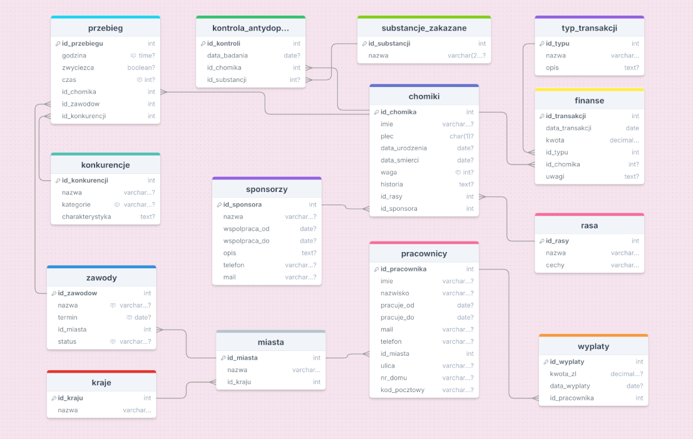

# Projekt grupowy - Bazy danych 2026

## 1. Spis użytych technologii

**Baza danych:**
* **MySQL** - relacyjna baza danych przechowująca informacje.

**Generowanie danych (Python):**
* **SQLAlchemy** - mapowanie obiektowo-relacyjne i komunikacja z bazą.
* **mysql-connector-python** - Sterownik łączący Pythona z serwerem MySQL.
* **Pandas** - przetwarzanie i strukturyzacja generowanych danych.
* **Faker** - generowanie realistycznych danych.

**Analiza i raport (R):**
* **R Markdown** - narzędzie do tworzenia dynamicznych raportów (HTML/PDF/Word).
* **RMariaDB i DBI** - interfejs połączenia R z bazą.
* **ggplot2** - biblioteka do wizualizacji danych (wykresy).
* **tidyverse** - manipulacja i agregacja danych wewnątrz R.    
* **knitr** - silnik generujący finalny dokument raportu.
* **lubridate** - biblioteka do łatwiejszego zarządzania czasem
* **ggrepel** - estetyka wykresów

**Wykorzystane oprogramowania:**
* **Visual Studio Code** - edytor kodu Python.
* **RStudio** - środowisko do obsługi języka R i generowania raportów.
* **XAMPP** - lokalny serwer bazy danych.

## 2. Lista plików i opis ich zawartości

**Generowanie danych:**
* **`data_generator.py`** - główny skrypt łączący się z bazą danych oraz generujący dane.
* **`functions.py`** - plik pomocniczy importowany przez główny generator. Zawiera funkcje użytkowe (np. `losuj_osobe`), pomaga zachować większą czytelność głównego kodu.
* **`requirements.txt`** - lista wymaganych bibliotek Python.

**Baza danych:**
* **`db_structure.sql`** - Plik SQL zawierający definicje struktury bazy danych (DDL). Tworzy tabele, klucze główne, obce oraz relacje.
* **`ERD.png`** - Graficzny schemat bazy danych (Entity Relationship Diagram) przedstawiający wizualnie połączenia między tabelami.

**Analiza i raport:**
* **`projekt_raport.Rmd`** - Kod źródłowy raportu w RMarkdown. Łączy się z wypełnioną bazą danych, pobiera wygenerowane i tworzy na ich podstawie wykresy analityczne.
* **`projekt_raport.html` / `.pdf`** - Wygenerowany, gotowy do odczytu raport końcowy (wynik działania pliku .Rmd).

**Inne:**
* **`README.md`** - Niniejsza dokumentacja projektu.
* **`.gitignore`** - Konfiguracja repozytorium Git (określa, które pliki mają być ignorowane).

# 3. Kolejność i sposób uruchamiania plików

Aby poprawnie uruchomić projekt i uzyskać pełną dokumentację analityczną, należy postępować zgodnie z poniższą instrukcją.

## Tworzenie bazy danych (Python)

1. Upewnij się, że Twój lokalny serwer bazy danych (np. **XAMPP**) jest uruchomiony.

2. Otwórz terminal w folderze projektu.

3. Zainstaluj wymagane biblioteki Python, wpisując:
   ```bash
   pip install -r requirements.txt
   ```

4. Sprawdź konfigurację połączenia w pliku **data_generator.py** (linia **CONN_STR**), upewniając się, że hasło i nazwa użytkownika (**root**) są zgodne z Twoim serwerem.

5. Uruchom skrypt generujący dane:
    ```bash
    python data_generator.py
    ```

    Skrypt automatycznie wczyta strukturę z pliku **db_structure.sql**, wyczyści ewentualne stare dane i wypełni tabele nowymi.

## Generowanie raportu i analiza danych (R)

1. Otwórz plik **projekt_raport.Rmd** w RStudio.

2. Zainstaluj wymagane pakiety R:
    ```R
    install.packages(c("tidyverse", "DBI", "RMariaDB", "knitr", "ggplot2", "ggrepel", "lubridate"))
    ```

3. Kliknij przycisk **Knit**, aby wygenerować plik HTML i PDF z analizą.

# 4. Schemat projektu bazy danych.


# 5. Lista zależności funkcyjnych.

W każdej relacji atrybut po lewej stronie strzałki (klucz główny) jednoznacznie determinuje wartości atrybutów po prawej stronie.

**Relacja: Chomiki**
* `id_chomika -> imie, plec, data_urodzenia, data_smierci, waga, historia, id_rasy, id_sponsora`

    **Wyjaśnienie:** _Unikalny identyfikator chomika określa jego rasę, dane biologiczne, historię oraz przypisanego sponsora._

**Relacja: Pracownicy**
* `id_pracownika -> imie, nazwisko, pracuje_od, pracuje_do, mail, telefon, id_miasta, ulica, nr_domu, kod_pocztowy`

    **Wyjaśnienie:** _Identyfikator pracownika określa jego dane osobowe, historię zatrudnienia oraz adres zamieszkania._

**Relacja: Przebieg**
* `id_przebiegu -> godzina, zwyciezca, czas, id_chomika, id_zawodow, id_konkurencji`

    **Wyjaśnienie:** _Każdy start w wyścigu ma unikalne ID, które wskazuje godzinę, kto biegł, w jakich zawodach, w jakiej konkurencji i z jakim wynikiem._

**Relacja: Zawody**
* `id_zawodow -> nazwa, termin, id_miasta, status`

    **Wyjaśnienie:**  _Dane wydarzenie sportowe jest identyfikowane przez ID, co określa jego nazwę, datę, miasto oraz status (np. odbyte)._

**Relacja: Finanse**
* `id_transakcji -> data_transakcji, kwota, id_typu, id_chomika, uwagi`

    **Wyjaśnienie:** _Każda operacja finansowa ma unikalny numer, który określa jej kwotę, datę, typ, którego chomika dotyczy oraz ewentualne uwagi._

**Relacja: Wypłaty**
* `id_wyplaty -> kwota_zl, data_wyplaty, id_pracownika`

    **Wyjaśnienie:** _Wypłaty są zdefiniowane przez ID, na daną kwotę, datę i odbiorcę (pracownika)._

**Relacja: Kontrola_antydopingowa**
* `id_kontroli -> data_badania, id_chomika, id_substancji`

    **Wyjaśnienie:** _Protokół kontroli ma swoje ID, które określa, kiedy badanie zostało wykonane, na którym chomiku i jaką substancję wykryto, o ile oczywiście jakąkolwiek wykryto, jeśli nie to NULL._

**Relacja: Miasta**
* `id_miasta -> nazwa, id_kraju`

    **Wyjaśnienie:** _Każde miasto ma unikalne ID i jest przypisane do konkretnego kraju._

**Relacja: Sponsorzy**
* `id_sponsora -> nazwa, wspolpraca_od, wspolpraca_do, opis, telefon, mail`

    **Wyjaśnienie:** _Sponsor jest identyfikowany przez ID, co determinuje jego dane kontaktowe i okres trwania umowy._

**Relacja: Konkurencje**
* `id_konkurencji -> nazwa, kategorie, charakterystyka`

    **Wyjaśnienie:** _Rodzaj dyscypliny sportowej (np. Sprint) jest określony przez ID._

**Relacja: Typ_transakcji**
* `id_typu -> nazwa, opis`

    **Wyjaśnienie:** _ID typu (np. 1) determinuje nazwę transakcji (np. "Opłata wpisowa")._

**Relacja: Rasa**
* `id_rasy -> nazwa, cechy`

    **Wyjaśnienie:** _Identyfikator rasy jednoznacznie wskazuje na jej nazwę i jej cechy charakterystyczne (np. szybki)._

**Relacja: Substancje_zakazane**
* `id_substancji -> nazwa`

    **Wyjaśnienie:** _Kod substancji określa jej nazwę._

**Relacja: Kraje**
* `id_kraju -> nazwa`

    **Wyjaśnienie:** _Identyfikator kraju wskazuje jego nazwę._

# 6. Uzasadnienie, że baza jest w EKNF.

Uzasadnienie dla poszczególnych tabel


* **Tabele słownikowe (kraje, rasy, konkurencje, substancje_zakazane)**
   
    **Klucze**: ID (PK) oraz nazwa (UQ) w każdej z tych tabel.
    
    **Analiza**: Są to relacje o minimalnej liczbie atrybutów. Jedynymi zależnościami są te wynikające z kluczy (np. id_kraju $\to$ nazwa_kraju). Spełniają warunek EKNF, ponieważ determinantem zawsze jest klucz.

* **Tabela pracownicy**

    **Klucze**: id_pracownika (PK), mail (UQ), telefon (UQ).

    **Uzasadnienie**: Wszystkie atrybuty (imie, nazwisko, data zatrudnienia, adres) zależą bezpośrednio od klucza głównego. Ponieważ mail i telefon są kluczami kandydującymi, każda zależność typu mail -> imie spełnia warunek EKNF (lewa strona jest kluczem). Brak zależności między atrybutami niekluczowymi.

* **Tabela sponsorzy**

    **Klucze**: id_sponsora (PK), nazwa (UQ), mail (UQ), telefon (UQ).

    **Uzasadnienie**: Każda kolumna opisowa (opis, daty współpracy) dotyczy konkretnego podmiotu identyfikowanego przez unikalną nazwę lub ID. Każda zależność funkcyjna ma po lewej stronie klucz kandydujący, co jest zgodne z EKNF.

 * **Tabela chomiki**

    **Klucze**: id_chomika.

    **Uzasadnienie**: Tabela łączy cechy fizyczne chomika i sponsora. Wszystkie cechy (plec, data_urodzenia,...) są atrybutami niekluczowymi zależnymi wyłącznie od id_chomika. Relacje do innych tabel (id_sponsora, id_rasy) to klucze obce, które nie tworzą między sobą dodatkowych zależności funkcyjnych.

 * **Tabela miasta**

    **Miasta**: Atrybut nazwa_miasta zależy od id_miasta i jest powiązany z id_kraju.


 * **Tabela zawody**
    
    **Klucze minimalne**: id_zawodow (PK), nazwa (UQ).

    **Uzasadnienie**: Dane o miejscu (id_miasta) i czasie zawodów zależą od unikalnego identyfikatora zawodów. Każda zależność funkcyjna wychodzi od klucza minimalnego.

 * **Tabela przebieg**

    **Klucze**: id_przebiegu (PK).

    **Uzasadnienie**: Jest to tabela faktów łącząca chomika, zawody i konkurencję z konkretnym wynikiem i pozycją. Wynik (czas/punkty) jest unikalny dla danej kombinacji chomika w danych zawodach, co sprawia, że każda kolumna zależy od klucza.

* **Tabela kontrola_antydopingowa**

    **Kontrola**: Łączy chomika z datą badania i substancją. Brak zależności między wynikiem badania, a innymi atrybutami niekluczowymi (każde badanie jest niezależnym wpisem).


# 7. Trudności podczas realizacji projektu.

Najtrudniejszym elementem projektu okazało się skonstruowanie logiki generatora, tak aby dane:

* Zachowały spójność dat,
* Były ze sobą powiązane w sposób logiczny,
* Nauczenie się konfigurowania połączenia z bazą danych.

Powyższe trudności miały znaczący wpływ na pozostałe etapy projektu, które musiały być podporządkowane strukturą pod generator danych, aby wszystko działało poprawnie. Niejednokrotnie zdażały się takie sytuacje jak np. wielokrotne poprawianie raportu wraz z analizą danych.

